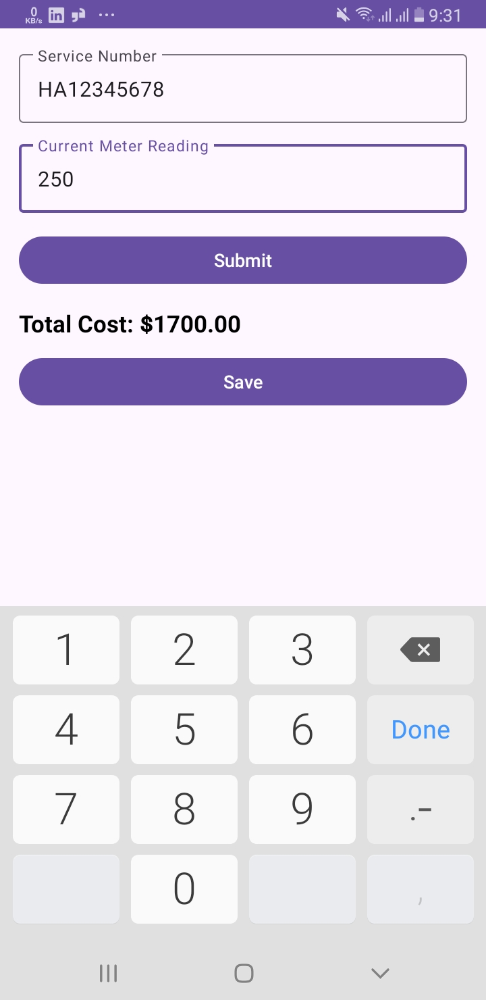
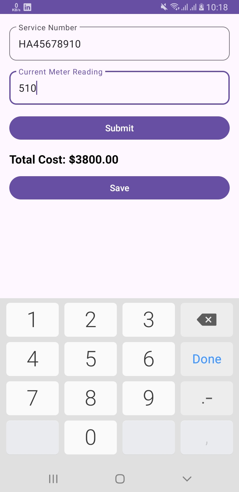
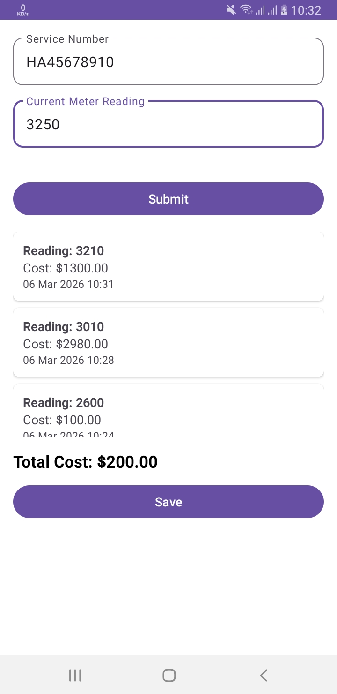

# Electricity Billing App

Android assessment project developed for the position of **Junior Android App Developer**.

This application calculates electricity consumption cost for households based on configurable slab rates and stores historical meter readings in Room DB.

---

# How to Run the Project

1. Open the project in **Android Studio**
2. Sync Gradle
3. Run the application on an emulator or Android device

---

## Features

- Service Number validation (10-digit alphanumeric, mandatory)
- Positive numeric meter reading validation
- Prevention of decreasing meter readings
- Configurable slab-based cost calculation
- Automatic calculation of consumption difference
- Display of last 3 historical readings with calculated costs
- Local storage using Room Database
- Professional Material Design UI

---

## How Cost Is Calculated

1. If customer has previous reading:
    - Consumption = Current Reading − Previous Reading
2. If customer has no previous reading:
    - Consumption = Current Reading
3. Consumption is applied against configured slab rates.
4. Cost is calculated progressively per slab.

Example slab configuration:

Consumption | Rate 
 1–100      | $5 per unit 
 101–500    | $8 per unit 
 >500       | $10 per unit 

---

## Slab Configuration

Slabs are configurable using a JSON file:

**Location:**

app/src/main/res/raw/slabs.json

# You can modify slab values before testing without changing the code

## Screenshots

## In Future
- I will add bill Summery
- User will export Bill in PDF
- User will share the Bill on Social Media as well and further more as i got idea 

# Develope by 
**Mudassir Khan**
**Android Developer**
